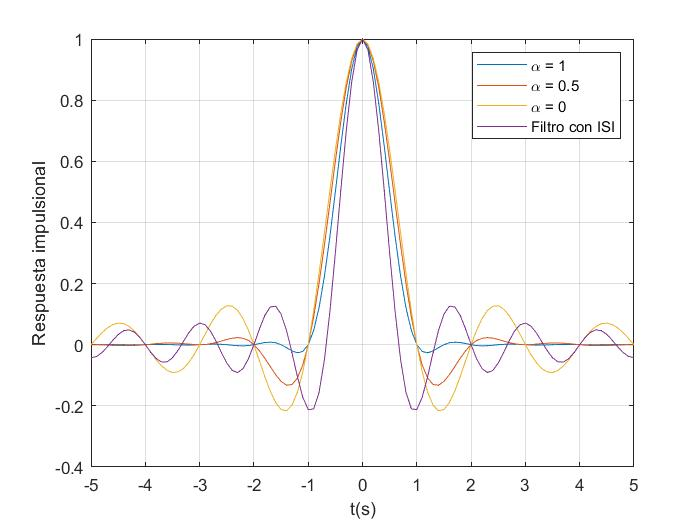

Sistemas de Comunicación I
# PRÁCTICA 2 - Detección Digital en Banda Base

Autores:
* *David Cocero Quintanilla*  
* *David Egea Hernández*

---

# 1. Respuesta impulsional y en frecuencia de varios filtros 

En esta 

1.	Comente la bondad relativa de los cuatro filtros para la transmisión en banda base en función de los criterios que estime conveniente.

